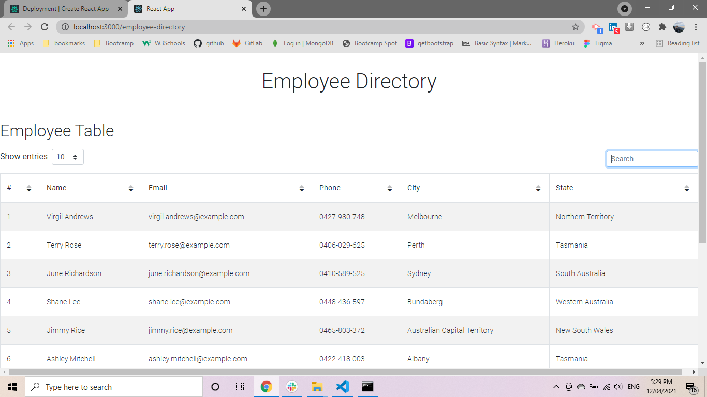
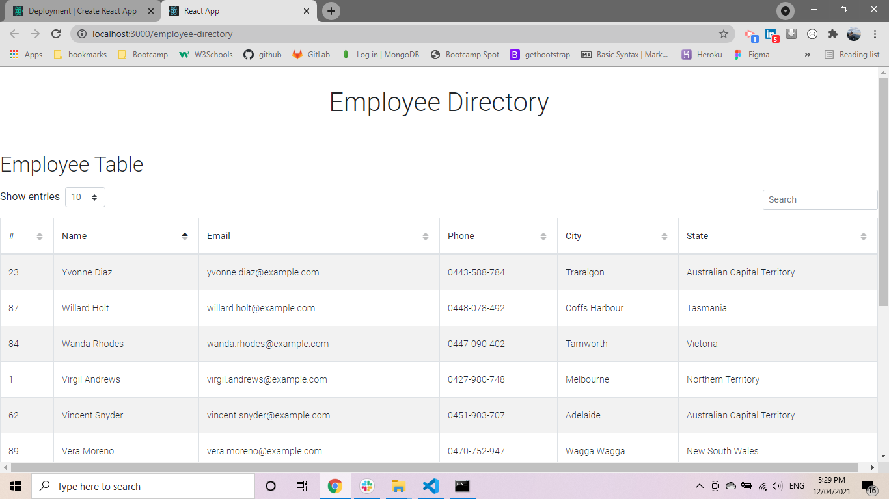
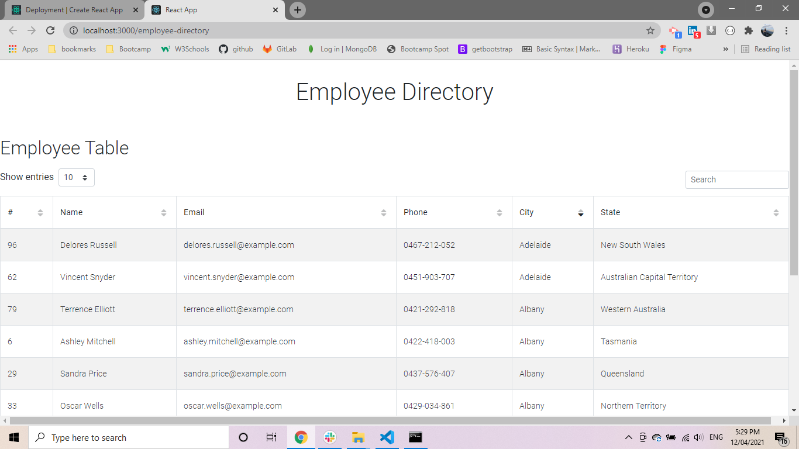
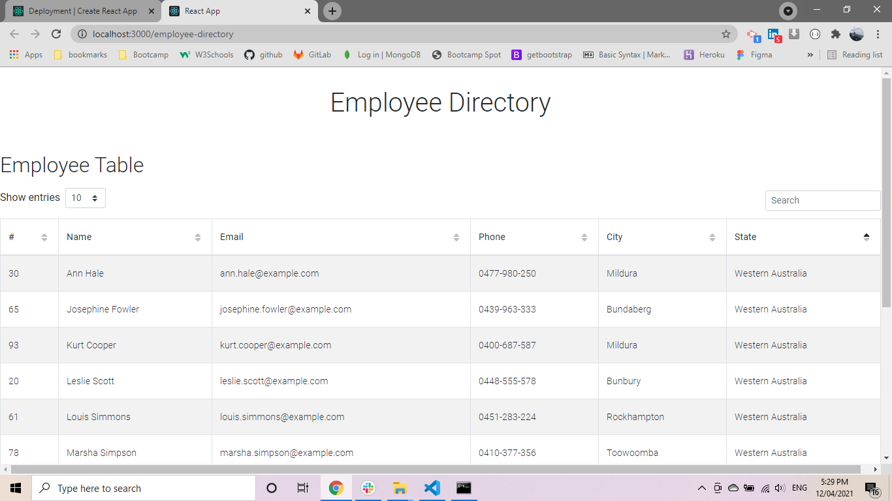
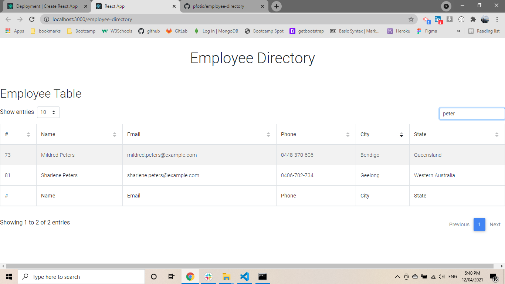
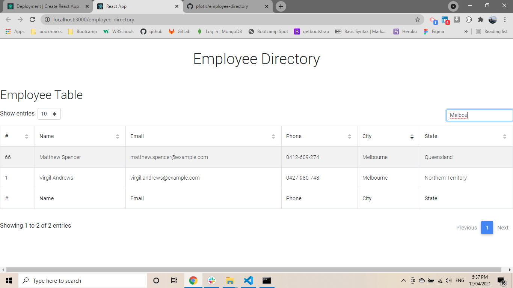
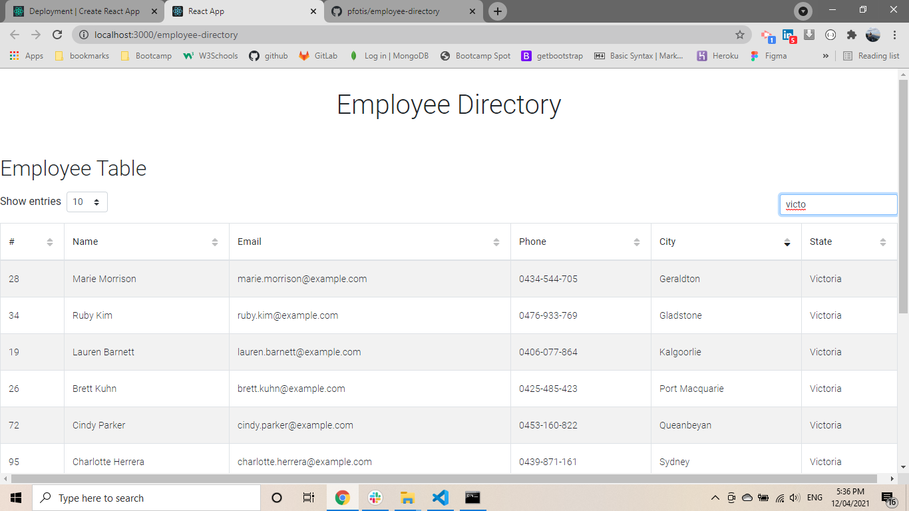

# employee-directory

* [links](#links)
* [Description](#description)
* [Built With](#builtwith)
* [Installation](#installation)
* [Screenshots](#screenshots)
* [Questions](#questions)

## links

[Repository link](https://github.com/pfotis/employee-directory)

[Heroku link](https://pfotis.github.io/employee-directory)

## Description

    At this application the user could sort by id, name, email, phone , city or state and the user could 
    search for any employee basic on the id, name, email, phone , city or state.

    The data we get from random API.

## Built With

    React.js
    HTML
    Bootstrap
    CSS
    Javascript

## Installation

    npx create-react-app employee-directory
    npm install axios
    npm install --save mdbreact
    npm install bootstrap-css-only
    npm i --save @fortawesome/fontawesome-free
    npm install --save gh-pages

## Screenshots

    With the following pictures the user could see the outfit of this project.

    sort by name

    sort by email

    sort by city

    sort by state

    search by name

    search by city

    search by state

## Questions

    For any questions about this repository, please contact me at pfotis@gmail.com
    View my work in GitHub pfotis(https://github.com/pfotis)